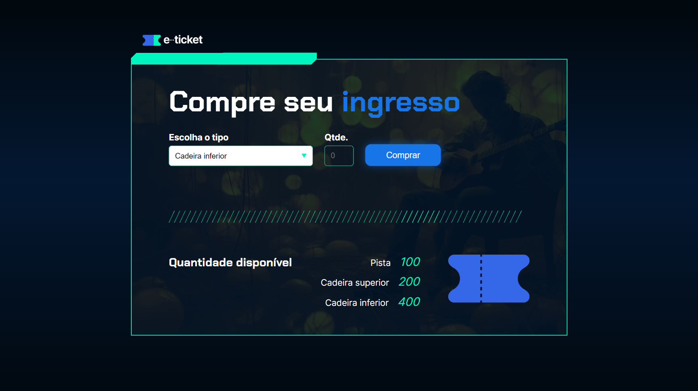

<h1>Compra de Ingressos 🎫</h1>

<h2>📜 Sobre</h2>

Projeto desenvolvido durante os cursos introdutórios à lógica de programação da Alura (com algumas modificações minhas).

Contém uma interface de compra de ingressos para shows.

<h2>✨ Funcionalidades</h2>
<ul>
  <li>Seleção do tipo de ingresso e quantidade desejada.</li>
  <li>Verificação de disponibilidade.</li>
  <li>Atualização de disponibilidade.</li>
</ul>

<h2>💻 Tecnologias</h2>

    
    
    

<h2>👁️ Preview</h2>

<h2>🤝 Desenvolvido por</h2>

João Faverão
